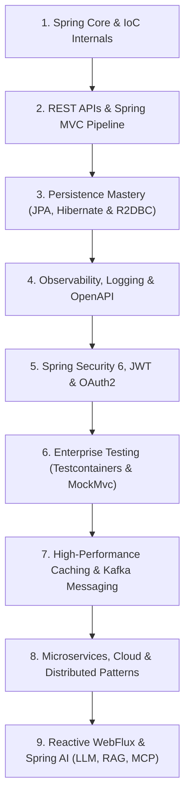

# 🚀 Spring Boot & Distributed Architecture Masterclass

[](https://spring.io/projects/spring-boot)
[](https://www.oracle.com/java/)
[](https://zensical.org)
[](https://rohit1024.github.io/spring-boot)
[](LICENSE)

An enterprise-grade, bottom-up mastery curriculum for **Spring Boot 3.x, Microservices, Cloud-Native Infrastructure, and Spring AI**. Built from first principles to demystify framework internals, teach production architectural design patterns, and prepare engineers for Senior Backend & System Design roles.

---

## 📖 Live Interactive Documentation

Explore the complete interactive portal, architectural diagrams, cheatsheets, and debugging playbooks:
👉 **[rohit1024.github.io/spring-boot](https://rohit1024.github.io/spring-boot)**

---

## 🎯 The Mission

Transition from Core Java & OOP fundamentals to architecting, deploying, and operating production-grade, distributed backend systems. 

- **First-Principles Demystification**: Zero "magic" — understand the exact reflection, CGLIB proxies, servlet dispatching loops, and bytecode mechanics behind Spring annotations.
- **Production-Grade Design**: Standardized DTOs, RFC 9457 `ProblemDetail` errors, MapStruct type-safe mapping, and GoF patterns (Strategy, Decorator, Template Method).
- **Enterprise Distributed Systems**: Kafka event streaming, Redis caching & rate limiting, SAGA orchestration, Transactional Outbox, CQRS, and Resilience4j.
- **Modern Cloud & AI**: Containerization with Docker & Kubernetes, CI/CD pipelines on AWS, and cutting-edge Spring AI (LLMs, Vector Stores, RAG, and MCP tool servers).

---

## 🗺️ Complete 9-Module Curriculum



### 🏛️ Module 1: Spring Core Fundamentals & Inversion of Control
- [x] [`0001`](docs/lessons/0001-spring-ioc-and-bean-lifecycle.md): **Spring IoC Container, Bean Scopes & Lifecycle**
- [x] [`0002`](docs/lessons/0002-dependency-injection-strategies.md): **Dependency Injection Strategies (Constructor vs Setter vs Field) & @Qualifier / @Primary**
- [x] [`0003`](docs/lessons/0003-spring-boot-autoconfiguration-internals.md): **Spring Boot Under the Hood: Auto-Configuration, @Conditional & Starter Mechanics**
- [x] [`0004`](docs/lessons/0004-aspect-oriented-programming-aop.md): **Aspect-Oriented Programming (AOP): Before, After, Around, After-Throwing Advice**
- [x] [`0005`](docs/lessons/0005-spring-profiles-and-environments.md): **Spring Profiles & Multi-Environment Configuration (`dev`, `stage`, `prod`)**

### 🌐 Module 2: RESTful Web Services & Spring MVC
- [x] [`0006`](docs/lessons/0006-servlet-architecture-and-dispatcherservlet.md): **Servlet Architecture vs Spring DispatcherServlet & Web MVC Pipeline**
- [x] [`0007`](docs/lessons/0007-building-restful-crud-apis.md): **Building RESTful CRUD APIs with Controllers, RequestMapping & HTTP Status Codes**
- [x] [`0008`](docs/lessons/0008-spring-bean-validation.md): **Spring Bean Validation (`@Valid`, Custom Validators & Constraint Annotations)**
- [x] [`0009`](docs/lessons/0009-global-exception-handling.md): **Global Exception Handling with `@RestControllerAdvice` & ProblemDetails (RFC 9457)**
- [x] [`0010`](docs/lessons/0010-dto-pattern-and-response-envelopes.md): **Standardizing Response Envelopes & DTO Pattern with Lombok & MapStruct**
- [x] [`0011`](docs/lessons/0011-design-patterns-strategy-decorator.md): **Design Patterns in Spring: Strategy & Decorator Patterns**

### 💾 Module 3: Persistence Mastery — Hibernate, JPA & R2DBC
- [ ] `0012`: **JDBC vs Hibernate ORM Internals: SessionFactory, Entity Lifecycle & Dirty Checking**
- [ ] `0013`: **Spring Data JPA: Repositories, Derived Query Methods & `@Query` (JPQL & Native)**
- [ ] `0014`: **Entity Relationships (1:1, 1:N, N:N), Fetch Types (Lazy vs Eager) & N+1 Problem**
- [ ] `0015`: **Multi-Database Integration: MySQL, PostgreSQL & NoSQL Databases (MongoDB/Cassandra)**
- [ ] `0016`: **Entity Auditing with `@CreatedDate`, `@LastModifiedBy` & Spring Data Envers**

### 🛠️ Module 4: Observability, Tooling & API Docs
- [ ] `0017`: **Supercharging Development with Spring DevTools & Live Reload**
- [ ] `0018`: **Production Health & Monitoring with Spring Boot Actuator & Metrics**
- [ ] `0019`: **API Documentation with OpenAPI 3 & Swagger UI**
- [ ] `0020`: **Structured Application Logging with SLF4J, Logback & Mapped Diagnostic Context (MDC)**
- [ ] `0021`: **Centralized Logging with ELK Stack (Elasticsearch, Logstash, Kibana)**

### 🔒 Module 5: Spring Security 6, OAuth2 & Identity
- [ ] `0022`: **Spring Security 6 Architecture: Filter Chains, AuthenticationManager & SecurityContext**
- [ ] `0023`: **Password Hashing (BCrypt, Argon2) & User Session Management**
- [ ] `0024`: **Stateless Authentication with JWT: Issuing, Validating & Filter Interception**
- [ ] `0025`: **Role-Based & Permission-Based Access Control (RBAC) with Method Security (`@PreAuthorize`)**
- [ ] `0026`: **Third-Party Authentication with Google OAuth2 & OpenID Connect (OIDC)**

### 🧪 Module 6: Enterprise Testing & Quality Assurance
- [ ] `0027`: **Unit Testing with JUnit 5 & AssertJ**
- [ ] `0028`: **Mocking Dependencies with Mockito (`@Mock`, `@InjectMocks`, `verify`)**
- [ ] `0029`: **Integration Testing REST APIs with `@SpringBootTest` & `MockMvc`**
- [ ] `0030`: **Database Integration Testing with Testcontainers**

### ⚡ Module 7: High-Performance Caching & Messaging Systems
- [ ] `0031`: **Spring Cache Abstraction with Redis (`@Cacheable`, `@CachePut`, `@CacheEvict`)**
- [ ] `0032`: **Redis Pub/Sub Messaging for Real-Time Event Fanout**
- [ ] `0033`: **Apache Kafka Architecture: Topics, Partitions, Offsets & Consumer Groups**
- [ ] `0034`: **Kafka Producer & Consumer Integration with Spring Kafka & DLQ (Dead Letter Queue)**
- [ ] `0035`: **Rate Limiting Algorithms in Redis: Token Bucket, Sliding Window, Fixed Window**

### 🧩 Module 8: Microservices, Cloud & Distributed Patterns
- [ ] `0036`: **Monolith vs Microservices: System Design Principles & Service Boundaries**
- [ ] `0037`: **Inter-Service Communication: RestTemplate, WebClient & Spring Cloud OpenFeign**
- [ ] `0038`: **Service Registry & Discovery with Spring Cloud Netflix Eureka**
- [ ] `0039`: **API Gateway Routing & Security with Spring Cloud Gateway**
- [ ] `0040`: **Centralized Configuration with Spring Cloud Config Server & Dynamic Bus Refresh**
- [ ] `0041`: **Distributed Tracing with Micrometer Tracing / Sleuth & Zipkin**
- [ ] `0042`: **Fault Tolerance with Resilience4j: Circuit Breaker, Retry, Bulkhead & Rate Limiter**
- [ ] `0043`: **Distributed Transactions: SAGA Pattern with Kafka Choreography**
- [ ] `0044`: **Guaranteed Message Delivery: Transactional Outbox Pattern with PostgreSQL & Kafka**
- [ ] `0045`: **High-Scale Reads: CQRS Architecture**
- [ ] `0046`: **Distributed Idempotency: Duplicate Prevention with Redis `SETNX`**
- [ ] `0047`: **CAP Theorem in Action: Consistency vs Availability in Payment Systems**
- [ ] `0048`: **Containerization: Dockerfile Multi-Stage Builds & Docker Compose**
- [ ] `0049`: **Kubernetes Orchestration: Pods, Deployments, Services, ConfigMaps & Dashboard**
- [ ] `0050`: **Cloud CI/CD: AWS CodePipeline, Buildspec & Elastic Beanstalk Deployment**

### 🚀 Module 9: Reactive Programming (WebFlux) & Spring AI
- [ ] `0051`: **Blocking vs Non-Blocking I/O: The Reactive Paradigm at Scale**
- [ ] `0052`: **Project Reactor Fundamentals: Mono, Flux, Schedulers & Reactive Pipeline Model**
- [ ] `0053`: **Building Reactive REST APIs with Spring WebFlux**
- [ ] `0054`: **Non-Blocking Persistence with R2DBC & Reactive Redis (`ReactiveRedisTemplate`)**
- [ ] `0055`: **Real-Time Streaming with Server-Sent Events (SSE)**
- [ ] `0056`: **Reactive Backpressure Handling: Bounded `flatMap` & Buffer Strategies**
- [ ] `0057`: **Integration Testing Reactive APIs with `WebTestClient` & Testcontainers**
- [ ] `0058`: **Spring AI: LLM Chat Clients, Prompts & Multi-Model Integration**
- [ ] `0059`: **Retrieval-Augmented Generation (RAG) with Vector Stores & Embeddings in Spring AI**
- [ ] `0060`: **MCP (Model Context Protocol) Server & Tool Integration with Spring AI**

---

## 🗂️ Repository Structure

```text
.
├── docs/
│   ├── lessons/        # Self-contained, progressive lessons with diagrams & quizzes
│   ├── cheatsheet/     # Operational cheat sheets & annotation lookups
│   ├── debugging/      # Deep-dive diagnostic playbooks for common failure modes
│   ├── interview/      # Curated Senior Spring Boot & System Design interview questions
│   ├── references/     # Canonical architecture glossary & authoritative primary sources
│   ├── mission.md      # Learning roadmap, constraints & scope definition
│   └── index.md        # Portal landing page
├── learning-records/   # Architectural learning records tracking milestone mastery
├── overrides/          # Custom branding icons and Zensical template extensions
├── pyproject.toml      # Documentation toolchain dependencies
├── README.md           # Repository overview & curriculum guide
└── zensical.toml       # Zensical site navigation and theme configuration
```

---

## 💻 Local Setup & Development

The documentation portal is powered by [Zensical](https://zensical.org) and Python [uv](https://github.com/astral-sh/uv).

### 1. Install `uv` (Fast Python Package Manager)
```bash
# macOS / Linux
curl -LsSf https://astral.sh/uv/install.sh | sh
```

### 2. Run Local Live-Reload Server
```bash
uv run zensical serve
```
Open your browser at `http://localhost:8000` to preview changes with instant hot reload.

### 3. Build Production Site
```bash
uv run zensical build
```

---

## 🤝 Contributing & Community

- Discussions and issues are welcome! Feel free to open a GitHub Issue or Pull Request if you find an opportunity to enhance code snippets or architectural explanations.
- Author: **Rohit Kharche** ([@rohit1024](https://github.com/rohit1024))
- License: MIT
